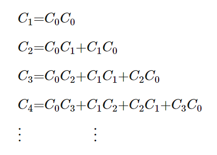
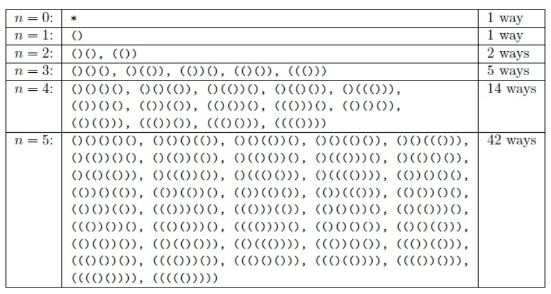
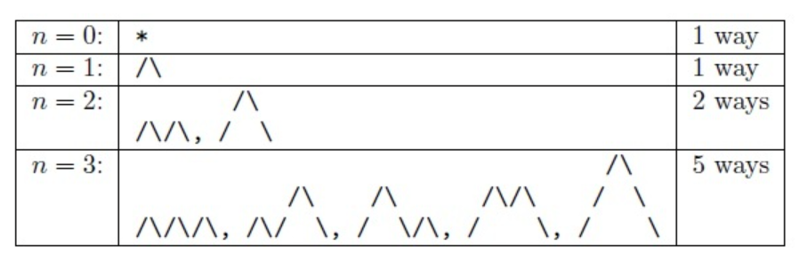
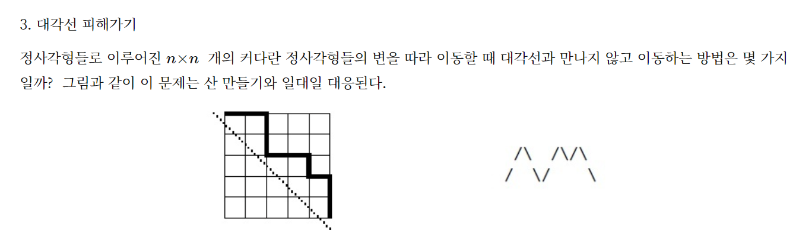
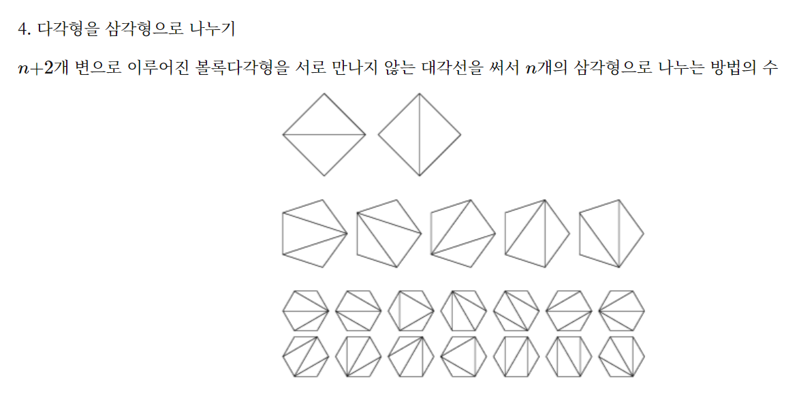

### 10422 괄호 (카탈란 수)

- [괄호 (10422)](https://www.acmicpc.net/problem/10422)

- 길이 L 이 주어졌을 때 길이가 L인 서로 다른 올바른 괄호 문자열의 갯수를 구하는 문제.
- ‘(‘, ‘)’ 문자로만 이루어진 문자열을 괄호 문자열이라 한다. 
  - () 는 올바른 괄호 문자열이다. 
  - S 가 올바른 괄호 문자열이라면, (S)도 올바른 괄호 문자열이다.
  - 두 문자열을 이어 붙인 ST도 올바른 괄호 문자열이다.
  - (()())()은 올바른 괄호 문자열이지만 (()은 올바른 괄호 문자열이 아니다.

<br>


### 개인적인 경험

나 역시도 점화식을 도출했었다. 그런데 아래 점화식에서 보듯 C1C2 C2C1 에 대한 예제를 2에 대한 조합을 만들어서 -1 을 하는 점화식이 도출됐었는데 C5 이상에서는 C3 에서도 이렇게 해야 하는지에 대한 확신이 안섰었다. 이것을 재귀 개념을 통한 점화식을 만들어 버텀업 개념으로만 접근하기에는 문제가 있었다. 

물론 재귀로 푸는 방법, 스택으로 푸는 방법 모두 알고 있었고, 프로그래머스에 같은 문제가 [코딩테스트 연습 \> 올바른 괄호의 갯수](https://school.programmers.co.kr/learn/courses/30/lessons/12929) 라는 문제가 있어서 이미 풀어본 상태였다. 하지만 일반적인 재귀, 스택 접근식의 풀이법으로는 백준온라인에서는 시간초과를 얻는다.<br>

인터넷에서 검색해보니 이 문제를 푸는 개념이 카탈란 수라는 것을 알았다. 점화식을 도출해내기 위해서는 카탈란 수의 개념을 이해해야 하는 것이었다.<br>

n-2, n-k 방식의 점화식을 통해 푸는 방법도 있었는데, 나한테는 난 [카탈란 수](https://suhak.tistory.com/77) 가 훨씬 이해가 쉬웠다. <br>

카탈란 수 개념을 찾아보면서 인터넷에 여러 자료가 많아서 어떤 자료가 맞는지 혼동이 왔었다.

그러다가 점화식이 제대로 적혀있는 수학개념을 찾아보다가 [카탈란 수](https://suhak.tistory.com/77) 를 접했다.<br>

다행히 점화식을 보고 코드로 풀어낼 수 있었다.<br>

<br>


이 외에도 D[k-2] x D[N-k] 의 합을 구하는 방식으로 푸는 방법이 있는데, 나한테는 도저히 이 방식은 무슨소리인지 이해가 안갔다. 이해가 간다면 이 방식 역시 풀이에 대한 설명을 별도의 문서에 정리해볼 생각은 있다. [10422 괄호](https://week-year.tistory.com/172) 에 나온 내용이다.<br>

<br>


### 참고자료

- [괄호 (10422)](https://www.acmicpc.net/problem/10422)
- [프로그래머스 - 올바른 괄호의 갯수 JAVA 풀이 (카탈란 수)](https://deftkang.tistory.com/222)
- [카탈란 수](https://suhak.tistory.com/77)


### 카탈란 수 개념

카탈란 수는 n개의 짝을 만드는 방법의 경우의 수를 나열한 수를 의미한다.

점화식은 아래와 같다.



<br>


아래 예제 1 인 괄호를 놓는 방법 문제를 짜놓는 방법의 수를 Cn 이라고 하자.

이제 C0,C1,C2,⋯,Cn−1 으로 Cn 을 나타내는 길을 찾아보자.

n−1쌍의 괄호가 잘 짜여진 것에 ()를 알맞은 곳에 넣어주는 방법을 세면 된다.

(A)B와 같이 넣는다고 하면 A와 B도 잘 짜여져 있어야 하고 만일 A에 괄호가 k쌍이 있다면 B에는 n−1−k 쌍이 있어야 한다.

이제 문제는 A와 B로 나누는 방법을 세면 된다.

따라서 위와 같은 점화식을 얻을 수 있다.


카탈란 수와 관련된 예제들은 아래 예제들이 있다.

n 쌍의 `()` 을 잘 짜인 모양으로 늘어놓는 방법은 몇가지가 있을까?


예제 1)



<br>


예제 2\)

또는 `\`, `/` 을 활용해서 n쌍을 이용해 산을 만들 수 있는 방법의 수는 어떻게 구할까?



<br>


예제 3)

대각선 피해가기 역시 산만들기 문제와 일대일 대응된다.




<br>

예제 4\)




### 코드

#### Bottom Up

점화식을 기준으로 Bottom Up 이 먼저 떠올라서 Bottom Up 으로 풀었다.


<br>


```java
import java.util.*;
public class Main {
    
    public static void main(String [] args){
        input();
        sol();
    }
    
    public static void sol(){
        dp_catalan();
    }
    
    public static void dp_catalan(){
        long mod = 1000000007L;
        long [] d = new long [5001];
        d[0] = 1;
        d[1] = 1;
        
        for(int i=2; i<=5000; i++){
            for(int k=1; k<=i; k++){
                d[i] = d[i] + (d[i-k] * d[k-1]);
                d[i] = d[i] % mod;
            }
        }
        
        for(int n : numbers){
            if(n % 2 == 1) System.out.println("0");
            else System.out.println(d[n/2]);
        }
    }
    
    static List<Integer> numbers = new ArrayList<>();
    
    public static void input(){
        Scanner sc = new Scanner(System.in);
        
        int t = sc.nextInt();
        while(t-- >0){
            numbers.add(sc.nextInt());
        }
    }
}
```


